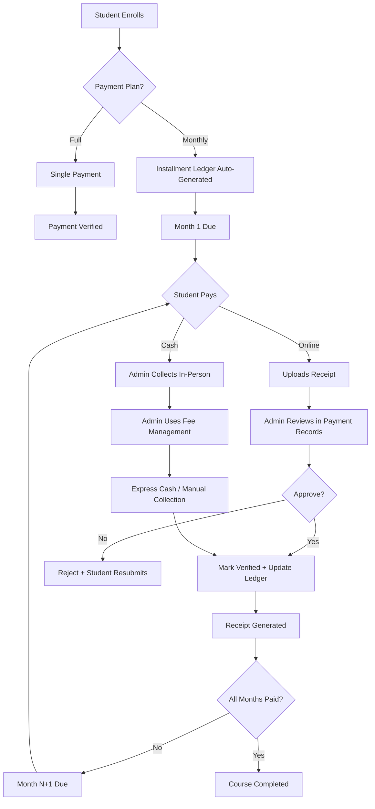

# Cashbook & Financial Management System - Complete Analysis

## Executive Summary

The Edu-Sphere LMS has a **multi-layered financial management system** consisting of:

1. **Manual Cashbook** (Excel-style spreadsheet for general accounting)
2. **Installment Ledger System** (Automated monthly fee tracking)
3. **Payment Records Module** (Transaction verification & receipt generation)
4. **Fee Management Dashboard** (Student-wise fee collection interface)

---

## 1. MANUAL CASHBOOK (`/admin/cashbook`)

### Purpose
Traditional accounting ledger for recording **all income and expenses** (beyond just student fees).

### Key Features

#### ✅ **Excel-Style Interface**
- **Spreadsheet layout** with rows, columns, and cell editing
- Real-time cell highlighting when active
- Row numbers and column headers (A-F style)
- Sortable by date

#### ✅ **Dual Ledgers**
- **Income Tab**: Records all revenue sources
  - Categories: Monthly Fee, Admission Fee, Certificate Fee, Book Sales, Grant/Aid, Other Income
- **Expenses Tab**: Records all operating costs
  - Categories: Salary, Electricity Bill, Rent, Stationery, Maintenance/Repair, Internet/Phone, Other Expense

#### ✅ **Financial Calculations**
- **Rupees (Rs)** and **Paisa (Ps)** separate columns
- Auto-calculated totals per ledger
- **Net Balance calculation**: Income - Expenses
- Real-time surplus/deficit indicator

#### ✅ **Data Management**
- **LocalStorage persistence** (key: `gccs_cashbook_v5`)
- Save/Load functionality
- Import/Export as JSON
- Month & Year selection
- Print-friendly layout

#### ✅ **User Experience**
- Color-coded entries (green for income, red for expenses)
- Row expansion/highlighting
- Date picker for entries
- Dropdown category selection

### Technical Stack
```typescript
// State Management
interface CashbookData {
  year: string;
  month: string;
  incomeEntries: LedgerEntry[];
  expenseEntries: LedgerEntry[];
}

interface LedgerEntry {
  id: string;
  date: string;
  description: string;
  category: string;
  rs: number;  // Rupees
  ps: number;  // Paisa
}
```

### Storage Location
- **LocalStorage**: `localStorage.getItem("gccs_cashbook_v5")`
- **No database integration** - purely client-side
- Exportable as JSON for backup

---

## 2. INSTALLMENT LEDGER SYSTEM

### Purpose
**Automated monthly fee tracking** for students on payment plans.

### Database Schema
```typescript
// Table: installment_ledger
{
  id: serial PRIMARY KEY,
  userId: integer NOT NULL,
  courseId: integer NOT NULL,
  monthNumber: integer NOT NULL,
  installmentAmount: real NOT NULL,
  totalFee: real NOT NULL,
  totalPaid: real DEFAULT 0,
  remainingBalance: real NOT NULL,
  status: "unpaid" | "partial" | "paid",
  paymentHistory: jsonb DEFAULT [],
  receiptNumber: text,
  createdAt: timestamp,
  updatedAt: timestamp
}

// Unique Index: (userId, courseId, monthNumber)
```

### API Endpoints

#### 📍 GET `/api/installment-ledger`
**Query params**: `?userId=X&courseId=Y`
- Lists all ledger entries (filterable)
- Joins with `users` and `courses` tables
- Returns aggregated payment state

#### 📍 POST `/api/installment-ledger/generate`
**Body**: `{ userId, courseId, totalFee, durationMonths }`
- Auto-generates monthly rows for the entire course duration
- Called when first payment is verified
- Uses upsert logic (doesn't overwrite existing)

#### 📍 POST `/api/installment-ledger/:id/collect`
**Body**: `{ amount, method, notes }`
- Records a partial/full payment for a month
- Updates aggregates: `totalPaid`, `remainingBalance`, `status`
- Appends to `paymentHistory` JSON array
- Creates a `paymentsTable` transaction record

### Auto-Generation Trigger
Located in `/api/payments` route:
```typescript
// After payment verification (line 165-187)
if (payment.paymentPlan === "monthly" && payment.totalFee) {
  const durationMonths = parseDurationMonths(course.duration);
  
  for (let m = 1; m <= durationMonths; m++) {
    // Create ledger row for each month
    await db.insert(installmentLedgerTable).values({
      userId, courseId, monthNumber: m,
      installmentAmount: monthlyAmount,
      totalFee, totalPaid: 0,
      remainingBalance: monthlyAmount,
      status: "unpaid",
      paymentHistory: [],
      receiptNumber: makeReceiptNumber(userId, courseId, m)
    });
  }
}
```

### Receipt Number Format
```
RCP-{YEAR}-U{userId:4}-C{courseId:3}-M{monthNum:2}
Example: RCP-2026-U0012-C005-M03
```

---

## 3. FEE MANAGEMENT DASHBOARD (`/admin/fees`)

### Purpose
**Central fee collection interface** with installment tracking and blocking controls.

### Key Features

#### ✅ **Course & Month Filter**
- Dropdown to select specific course
- Month selector (dynamic based on course duration)
- Shows only relevant students

#### ✅ **Dedicated Dashboard Metrics**
- Total Expected Revenue
- Total Collected
- Outstanding Dues
- Enrollment counts (Active, Blocked, Pending)

#### ✅ **Student Roster Table**
Each row shows:
- Student name & enrollment status
- Course name & fee
- Payment plan (monthly/full)
- Total paid vs remaining
- Next due month indicator

#### ✅ **Month-by-Month Ledger View**
Expandable rows showing:
- All months in grid format
- Status badges: ✅ Paid | ⏰ Partial | ❌ Unpaid
- Payment history with amounts, dates, methods
- **Express Cash button** for instant collection

#### ✅ **Collection Dialogs**
1. **Collect Payment Modal**
   - Amount input (validates against remaining balance)
   - Payment method: Cash, Bank Transfer, EasyPaisa, JazzCash
   - Notes field
   - **Optimistic UI updates** (instant feedback)

2. **Manual Fee Collection Sidebar**
   - Select student from dropdown
   - Choose month number
   - Enter amount & method
   - Auto-generates ledger if needed

#### ✅ **Access Controls**
- **Block/Restore Login**: Disable user account
- **Block/Restore Course**: Suspend enrollment access
- Instant visual feedback with badges

### Optimistic Updates
```typescript
// UI updates BEFORE API call completes
const optimisticNewPaid = ledger.totalPaid + amount;
const optimisticRemaining = Math.max(0, ledger.installmentAmount - optimisticNewPaid);
const optimisticStatus = optimisticRemaining <= 0 ? "paid" : "partial";

setLedgerEntries(prev => prev.map(l =>
  l.id === ledger.id
    ? { ...l, totalPaid: optimisticNewPaid, remainingBalance: optimisticRemaining, status: optimisticStatus }
    : l
));
```

### Performance Optimizations
- **Filtered API calls**: Only fetch ledgers for selected course
- **Light background sync**: Non-blocking query invalidation
- **No full refetch**: Patches state with server response
- **LocalStorage cache**: Reduces repeated queries

---

## 4. PAYMENT RECORDS MODULE (`/admin/payments`)

### Purpose
**Course-wise monthly payment tracking & verification** with bulk operations.

### Key Features

#### ✅ **Course & Month Selection**
- Dropdown filters for course and specific month
- Dynamic month names: "January 2026", "February 2026" (based on course start date)
- Student search box

#### ✅ **Dashboard Statistics**
- Total Students enrolled
- Paid Count (verified)
- Pending Count (awaiting review)
- Unpaid Count
- Total Collected Amount

#### ✅ **Status Tabs**
- All Status
- Paid (green badge)
- Pending (amber badge, animated pulse)
- Unpaid (red badge)

#### ✅ **Student Payment Table**
Columns:
- Checkbox for bulk selection
- Student Name
- Amount Due (installment amount)
- Month Status badge
- Total Paid (lifetime)
- Installments (X/Y months paid)
- Last Payment Date
- Receipt Button
- Action Buttons (Review/Collect)

#### ✅ **Payment Review Dialog**
For pending online submissions:
- Student info
- Uploaded receipt image preview
- Amount & method
- **Approve** ✅ or **Reject** ❌ buttons
- Optional admin notes
- Auto-generates printed receipt after verification

#### ✅ **Manual Payment Recording**
Modal form with:
- Student selector (enrollment-based)
- Month number
- Amount input
- Payment method dropdown
- Notes field
- Creates payment record + auto-verifies + shows receipt

#### ✅ **Bulk Verification**
- Select multiple students with checkboxes
- "Verify Selected" button
- Processes all pending payments at once
- Toast notifications for success/failure

#### ✅ **Receipt Generation**
`<FeeReceipt>` component generates printable receipt:
- College logo & letterhead
- Student & course details
- Month name with year
- Payment amount, method, date
- Receipt number (auto-generated)
- Admin signature section

### Payment Verification Flow
```typescript
// Step 1: Student uploads receipt via portal
POST /api/payments -> status: "pending"

// Step 2: Admin reviews in Payment Records
GET /api/payments -> filters pending

// Step 3: Admin approves
POST /api/payments/:id/verify -> { status: "verified", notes }

// Step 4: System actions
- Update payment status
- Trigger installment ledger collection
- Generate receipt
- Send notification to student
```

---

## 5. INTEGRATED WORKFLOW

### Student Enrollment → Fee Collection Lifecycle



### Data Flow Between Modules

```
┌─────────────────────────────────────────────────────────────┐
│                     CASHBOOK (Manual)                        │
│  • General income/expenses                                   │
│  • LocalStorage only                                         │
│  • No integration with other modules                         │
└─────────────────────────────────────────────────────────────┘

┌─────────────────────────────────────────────────────────────┐
│              PAYMENT RECORDS (Verification Hub)              │
│  • Reviews online submissions                                │
│  • Manual payment entry                                      │
│  • Bulk operations                                          │
│  • Generates receipts                                       │
└──────────┬──────────────────────────────────┬───────────────┘
           │                                  │
           ▼                                  ▼
    ┌──────────────┐                  ┌──────────────┐
    │  payments    │◄─────────────────┤ installment  │
    │   table      │                  │   _ledger    │
    └──────────────┘                  └──────────────┘
           ▲                                  ▲
           │                                  │
           └──────────────────────────────────┘
                          │
                          ▼
           ┌──────────────────────────────────┐
           │    FEE MANAGEMENT (Collection)   │
           │  • Course/month filter           │
           │  • Student roster                │
           │  • Express cash collection       │
           │  • Access controls (block/restore)│
           └──────────────────────────────────┘
```

---

## 6. STRENGTHS OF THE SYSTEM

### ✅ **Dual Accounting Approach**
- **Manual Cashbook**: Flexible for non-student transactions
- **Automated Ledger**: Systematic for recurring student fees

### ✅ **Month-Level Granularity**
- Each month has independent tracking
- Partial payments supported
- Payment history preserved in JSON

### ✅ **Optimistic UI Updates**
- Instant feedback for admins
- Background sync for data accuracy
- No full page reloads

### ✅ **Multiple Collection Methods**
- Online submission + admin review
- In-person cash collection (express button)
- Manual backdated entry

### ✅ **Access Control Integration**
- Block login if fees overdue
- Block course access separately
- Real-time status badges

### ✅ **Receipt Generation**
- Auto-numbered receipts
- Printable format
- Shows after every verified payment

---

## 7. AREAS FOR IMPROVEMENT

### 🔴 **Cashbook Limitations**
**Issue**: Manual cashbook is client-side only (LocalStorage)
- **Risk**: Data loss if browser cache cleared
- **Solution**: Migrate to database with versioned backups

### 🔴 **No Reconciliation**
**Issue**: Cashbook and payment system are disconnected
- Student fees verified in Payment Records don't auto-sync to Cashbook income
- **Solution**: Add "Sync to Cashbook" button that exports verified payments as income entries

### 🔴 **No Financial Reports**
**Issue**: No consolidated monthly/yearly financial statements
- **Solution**: Add reports module that combines:
  - Cashbook totals
  - Payment collection totals
  - Outstanding dues
  - Expense breakdown

### 🔴 **Receipt Numbering**
**Issue**: Receipt numbers tied to ledger ID (can skip numbers if ledgers deleted)
- **Solution**: Use separate `receipt_counter` table with atomic increments

### 🔴 **No Audit Trail**
**Issue**: Payment history in JSON array (not queryable)
- **Solution**: Create separate `payment_transactions` table:
  ```sql
  CREATE TABLE payment_transactions (
    id serial PRIMARY KEY,
    ledger_id integer REFERENCES installment_ledger(id),
    amount real NOT NULL,
    method text NOT NULL,
    collected_by integer REFERENCES users(id),
    notes text,
    created_at timestamp DEFAULT now()
  );
  ```

### 🔴 **No Refund Support**
**Issue**: Cannot reverse or refund a payment
- **Solution**: Add refund workflow with negative transaction entries

### 🔴 **Date Handling**
**Issue**: Month calculation based on `course.createdAt` can be wrong if enrollment is delayed
- **Solution**: Use `enrollment.enrolledAt` as base date instead

---

## 8. SECURITY CONSIDERATIONS

### ✅ **Current Protections**
- Admin-only routes (`authorize("admin")` middleware)
- JWT token authentication
- Amount validation (cannot exceed remaining balance)
- Status checks (cannot collect from "paid" months)

### 🔴 **Missing Protections**
- **No IP logging** for financial transactions
- **No two-factor auth** for payment approvals
- **No transaction locking** (concurrent admins could double-collect)
- **No backup/restore** for cashbook data

### Recommended Additions
```typescript
// Add transaction locking
await db.execute(sql`
  SELECT * FROM installment_ledger 
  WHERE id = ${id} 
  FOR UPDATE  -- Locks row until transaction commits
`);

// Add audit log
await db.insert(auditLogsTable).values({
  adminId: req.user.id,
  action: "fee_collected",
  entityType: "installment_ledger",
  entityId: ledger.id,
  amount: amount,
  ipAddress: req.ip,
  userAgent: req.headers['user-agent']
});
```

---

## 9. RECOMMENDED NEXT STEPS

### Priority 1: Data Integrity
1. **Migrate cashbook to database** (`cashbook_entries` table)
2. **Add reconciliation report** (cashbook vs payments)
3. **Implement backup/export** for financial data

### Priority 2: Automation
1. **Auto-sync verified payments to cashbook income**
2. **Auto-generate monthly financial reports**
3. **Auto-send payment reminders** to students

### Priority 3: Reporting
1. **Monthly financial statement** (income vs expenses)
2. **Outstanding dues report** (overdue by X days)
3. **Revenue by course** analytics dashboard

### Priority 4: Compliance
1. **Audit trail for all financial changes**
2. **Receipt archive** (searchable by date/student/course)
3. **Tax calculation helpers** (for government reporting)

---

## 10. CONCLUSION

The Edu-Sphere cashbook system is **well-designed for basic operations** with:
- ✅ Clean separation of manual vs automated accounting
- ✅ Month-level installment tracking
- ✅ Optimistic UI for fast admin workflows
- ✅ Multiple payment collection methods

However, it needs **enterprise-level improvements** for production use:
- ❌ Database persistence for cashbook
- ❌ Reconciliation between modules
- ❌ Comprehensive audit trails
- ❌ Financial reporting suite

**Overall Grade: B+ (Good foundation, needs polish for scale)**

---

## Technical Contact Points

### Files to Modify for Improvements

1. **Cashbook Database Migration**
   - `db/src/schema/settings.ts` (add `cashbookEntriesTable`)
   - `server/src/routes/cashbook.ts` (new route)
   - `client/src/pages/admin/cashbook.tsx` (update to use API)

2. **Reconciliation Report**
   - `server/src/routes/reports.ts` (add `/reports/financial-reconciliation`)
   - `client/src/pages/admin/reports.tsx` (new tab)

3. **Audit Trail**
   - `db/src/schema/audit-logs.ts` (new table)
   - Modify all payment routes to log changes

4. **Receipt Archive**
   - `server/src/routes/receipts.ts` (new route)
   - `client/src/pages/admin/receipts.tsx` (searchable archive page)

---

**Document Generated**: June 28, 2026  
**Analysis Version**: 1.0  
**System Version**: Edu-Sphere LMS v2.0 (Installments v2)
